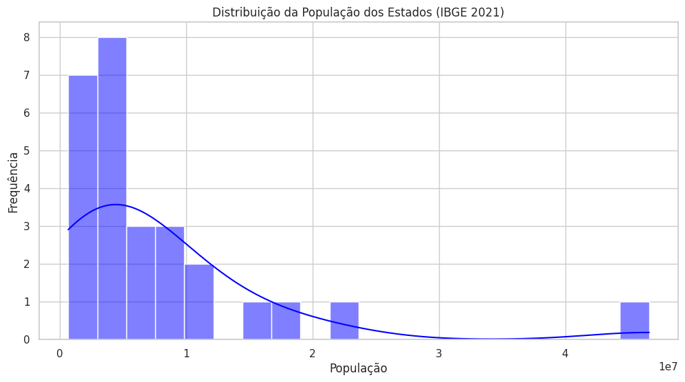

# Análise de População dos Estados Brasileiros com Dados do IBGE

## Descrição
Este projeto realiza uma análise exploratória dos dados populacionais dos estados brasileiros utilizando informações do IBGE. O código processa os dados, gera visualizações gráficas e exibe estatísticas descritivas para facilitar a compreensão da distribuição populacional.

## Tecnologias Utilizadas
- Python
- Pandas
- Matplotlib
- Seaborn

## Funcionalidades
- **Ordenação por população**: Seleciona os 10 estados mais populosos.
- **Gráfico de barras**: Exibe a população dos estados mais populosos.
- **Distribuição da população**: Histograma que mostra a concentração populacional.
- **Dispersão da população**: Gráfico de dispersão para comparar populações entre estados.
- **Estatísticas descritivas**: Exibe informações como média, mediana, valores máximos e mínimos.

## Como Utilizar
1. Certifique-se de ter o Python instalado.
2. Instale as dependências necessárias com:
   pip install pandas matplotlib seaborn
3. Execute o script Python e visualize os gráficos gerados.
## Imagens de exemmplo da analise exploratoria

Projeto desenvolvido para exploração de dados do IBGE.

